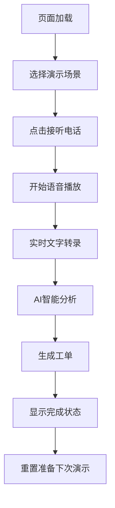

# 12345热线智能工单管理系统 Demo 产品需求文档 (PRD)

## 文档信息
- **产品名称**: 12345热线智能工单管理系统演示版
- **文档版本**: v1.0
- **创建日期**: 2024-12-01
- **产品类型**: Demo演示系统
- **目标用户**: 政府部门决策者、技术人员、产品展示

## 1. 产品概述

### 1.1 产品定位
本产品是一个前端演示系统，用于展示基于LLM的智能工单管理在12345政务服务热线中的应用效果。通过模拟真实的电话接听、语音识别、智能分析和工单派发流程，向用户展示AI技术在政务服务中的价值。

### 1.2 产品目标
- **主要目标**: 展示LLM在政务服务中的智能化应用能力
- **演示重点**: 语音识别、自动分类、优先级排序、智能派发
- **预期效果**: 让观众理解AI如何提升政务服务效率和质量

### 1.3 产品范围
- ✅ **包含**: 前端UI/UX演示、模拟数据、交互动画
- ❌ **不包含**: 后端服务、真实语音识别、数据库存储

## 2. 用户分析

### 2.1 目标用户
| 用户类型 | 用户特征 | 关注点 |
|---------|---------|--------|
| 政府决策者 | 关注政策效果和投资回报 | 系统效益、成本节约、服务提升 |
| 技术负责人 | 关注技术实现和可行性 | 技术架构、实现难度、集成方案 |
| 业务人员 | 关注操作便利性和实用性 | 界面友好度、功能完整性、流程合理性 |

### 2.2 使用场景
- **产品展示会**: 向客户演示产品能力
- **技术交流**: 与技术团队讨论实现方案
- **内部培训**: 帮助团队理解产品功能

## 3. 功能需求

### 3.1 核心功能模块

#### 3.1.1 电话模拟模块
**功能描述**: 模拟12345热线的来电接听过程

| 功能点 | 优先级 | 详细描述 |
|-------|--------|----------|
| 来电显示 | P0 | 显示来电号码、时间、地区信息 |
| 通话控制 | P0 | 接听/挂断按钮，通话时长计时 |
| 录音状态 | P1 | 录音指示灯，音频波形显示 |
| 信号质量 | P2 | 模拟信号强度指示器 |

**交互规则**:
- 点击接听按钮开始演示流程
- 通话时长实时更新
- 录音状态与通话状态联动

#### 3.1.2 语音识别模块
**功能描述**: 模拟语音转文字的实时识别过程

| 功能点 | 优先级 | 详细描述 |
|-------|--------|----------|
| 实时转录 | P0 | 文字逐字显示，模拟识别过程 |
| 置信度显示 | P1 | 显示识别准确度百分比 |
| 关键词高亮 | P1 | 自动标记重要信息 |
| 语音回放 | P2 | 支持重复播放语音片段 |

**交互规则**:
- 转录文字以打字机效果逐字显示
- 关键词用不同颜色高亮显示
- 置信度低于80%时显示警告

#### 3.1.3 AI智能分析模块
**功能描述**: 展示LLM对市民请求的智能分析结果

| 功能点 | 优先级 | 详细描述 |
|-------|--------|----------|
| 问题分类 | P0 | 自动识别问题类型（噪音投诉、道路维修等） |
| 优先级判断 | P0 | 基于紧急程度分为高/中/低三级 |
| 关键信息提取 | P0 | 提取地址、时间、涉及对象等信息 |
| 部门派发 | P0 | 智能匹配对应的处理部门 |
| 置信度评估 | P1 | 显示各项分析结果的可信度 |

**分析规则**:
```
优先级判断规则:
- 高优先级: 包含"安全隐患"、"紧急"、"危险"等关键词
- 中优先级: 涉及基础设施、公共服务问题
- 低优先级: 政策咨询、一般建议类问题

分类规则:
- 噪音投诉: 包含"噪音"、"吵闹"、"扰民"等关键词
- 道路维修: 包含"坑洞"、"路面"、"维修"等关键词
- 政策咨询: 包含"咨询"、"政策"、"手续"等关键词
```

#### 3.1.4 工单生成模块
**功能描述**: 自动生成结构化的工单信息

| 功能点 | 优先级 | 详细描述 |
|-------|--------|----------|
| 工单信息填充 | P0 | 自动填充工单各项字段 |
| 编号生成 | P0 | 生成唯一工单编号 |
| 状态跟踪 | P1 | 显示工单当前处理状态 |
| 时效预估 | P1 | 预估处理完成时间 |

### 3.2 预设演示场景

#### 3.2.1 场景数据结构
```javascript
const demoScenarios = [
  {
    id: 1,
    title: "噪音投诉案例",
    callerInfo: {
      phone: "138****1234",
      location: "朝阳区建国路88号"
    },
    audioScript: "您好，我要投诉楼下餐厅的噪音问题...",
    expectedResult: {
      category: "噪音投诉",
      priority: "高",
      department: "朝阳区城管执法局",
      keywords: ["噪音", "餐厅", "安全隐患"]
    }
  }
  // 更多场景...
];
```

#### 3.2.2 场景切换功能
| 功能点 | 优先级 | 详细描述 |
|-------|--------|----------|
| 场景选择器 | P1 | 下拉菜单选择不同演示场景 |
| 快速切换 | P1 | 支持键盘快捷键切换场景 |
| 场景重置 | P1 | 一键重置当前演示状态 |

## 4. 非功能需求

### 4.1 性能要求
- **页面加载时间**: ≤ 3秒
- **动画流畅度**: ≥ 60fps
- **响应时间**: 用户操作响应 ≤ 200ms

### 4.2 兼容性要求
- **浏览器支持**: Chrome 80+, Firefox 75+, Safari 13+, Edge 80+
- **设备支持**: 桌面端、平板、手机
- **分辨率支持**: 1920x1080, 1366x768, 375x667

### 4.3 可用性要求
- **界面语言**: 简体中文
- **操作复杂度**: 单击操作不超过3次完成主要功能
- **学习成本**: 无需培训即可上手操作

## 5. 界面设计规范

### 5.1 设计原则
- **简洁明了**: 突出核心功能，避免冗余元素
- **专业可信**: 体现政务系统的严谨性
- **直观易懂**: 流程清晰，状态明确

### 5.2 视觉规范

#### 5.2.1 色彩规范
```css
/* 主色调 */
--primary-color: #1890FF;      /* 政务蓝 */
--success-color: #52C41A;      /* 成功绿 */
--warning-color: #FA8C16;      /* 警告橙 */
--error-color: #FF4D4F;        /* 错误红 */
--text-color: #262626;         /* 主文字 */
--text-secondary: #8C8C8C;     /* 次要文字 */
--background-color: #F5F5F5;   /* 背景色 */
```

#### 5.2.2 字体规范
```css
/* 字体大小 */
--font-size-large: 18px;       /* 标题 */
--font-size-base: 14px;        /* 正文 */
--font-size-small: 12px;       /* 辅助信息 */

/* 字体权重 */
--font-weight-bold: 600;       /* 加粗 */
--font-weight-normal: 400;     /* 常规 */
```

#### 5.2.3 间距规范
```css
/* 间距单位 */
--spacing-xs: 4px;
--spacing-sm: 8px;
--spacing-md: 16px;
--spacing-lg: 24px;
--spacing-xl: 32px;
```

### 5.3 组件规范

#### 5.3.1 按钮规范
| 类型 | 样式 | 使用场景 |
|------|------|----------|
| 主按钮 | 蓝色背景，白色文字 | 主要操作（接听电话） |
| 次按钮 | 白色背景，蓝色边框 | 次要操作（重置） |
| 危险按钮 | 红色背景，白色文字 | 危险操作（挂断电话） |

#### 5.3.2 状态指示器
| 状态 | 颜色 | 图标 | 说明 |
|------|------|------|------|
| 进行中 | 蓝色 | 旋转图标 | 正在处理 |
| 成功 | 绿色 | ✓ | 处理完成 |
| 警告 | 橙色 | ⚠ | 需要注意 |
| 错误 | 红色 | ✗ | 处理失败 |

## 6. 交互设计

### 6.1 页面布局

#### 6.1.1 桌面端布局 (≥1200px)
```
┌─────────────────────────────────────────────────────┐
│                    顶部导航栏                        │
├─────────────────┬─────────────────┬─────────────────┤
│                 │                 │                 │
│   电话模拟区     │   实时处理区     │   工单生成区     │
│   (宽度: 30%)   │   (宽度: 40%)   │   (宽度: 30%)   │
│                 │                 │                 │
└─────────────────┴─────────────────┴─────────────────┘
```

#### 6.1.2 移动端布局 (≤768px)
```
┌─────────────────────────────────────┐
│            顶部导航栏                │
├─────────────────────────────────────┤
│                                     │
│            电话模拟区                │
│                                     │
├─────────────────────────────────────┤
│                                     │
│            实时处理区                │
│                                     │
├─────────────────────────────────────┤
│                                     │
│            工单生成区                │
│                                     │
└─────────────────────────────────────┘
```

### 6.2 操作流程

#### 6.2.1 主流程设计


#### 6.2.2 时间轴设计
| 时间点 | 操作 | 视觉反馈 | 持续时间 |
|--------|------|----------|----------|
| 0s | 点击接听 | 按钮状态变化 | 即时 |
| 0-2s | 建立连接 | 连接动画 | 2s |
| 2-20s | 语音播放 | 文字逐字显示 | 18s |
| 20-23s | AI分析 | 进度条动画 | 3s |
| 23-25s | 工单生成 | 表单填充动画 | 2s |
| 25s | 完成确认 | 成功状态显示 | 持续 |

### 6.3 动画效果

#### 6.3.1 关键动画
| 动画名称 | 触发条件 | 效果描述 | 持续时间 |
|----------|----------|----------|----------|
| 来电闪烁 | 模拟来电 | 呼吸灯效果 | 循环 |
| 文字打字 | 语音转录 | 逐字显示 | 根据语速 |
| 进度加载 | AI分析 | 进度条填充 | 3s |
| 状态切换 | 流程转换 | 淡入淡出 | 0.3s |

#### 6.3.2 微交互设计
- **按钮悬停**: 颜色加深，轻微放大
- **卡片悬停**: 阴影加深，轻微上移
- **输入焦点**: 边框高亮，内阴影
- **加载状态**: 骨架屏或旋转图标

## 7. 技术实现

### 7.1 技术栈选择
- **前端框架**: React 18+ / Vue 3+
- **UI组件库**: Ant Design / Element Plus
- **状态管理**: Redux Toolkit / Pinia
- **动画库**: Framer Motion / Vue Transition
- **构建工具**: Vite / Webpack 5
- **代码规范**: ESLint + Prettier

### 7.2 项目结构
```
src/
├── components/          # 通用组件
│   ├── PhoneSimulator/  # 电话模拟组件
│   ├── VoiceRecognition/# 语音识别组件
│   ├── AIAnalysis/      # AI分析组件
│   └── TicketGeneration/# 工单生成组件
├── pages/              # 页面组件
├── hooks/              # 自定义Hook
├── utils/              # 工具函数
├── constants/          # 常量定义
├── assets/             # 静态资源
└── styles/             # 样式文件
```

### 7.3 数据模拟

#### 7.3.1 模拟数据接口
```javascript
// 场景数据接口
interface DemoScenario {
  id: string;
  title: string;
  description: string;
  callerInfo: CallerInfo;
  audioScript: string;
  audioFile?: string;
  expectedAnalysis: AnalysisResult;
  estimatedDuration: number;
}

// 分析结果接口
interface AnalysisResult {
  category: string;
  priority: 'high' | 'medium' | 'low';
  keywords: string[];
  location: string;
  department: string;
  confidence: {
    category: number;
    priority: number;
    department: number;
  };
}
```

## 8. 测试计划

### 8.1 功能测试
- [ ] 场景切换功能正常
- [ ] 电话接听流程完整
- [ ] 语音转录显示正确
- [ ] AI分析结果准确
- [ ] 工单生成信息完整
- [ ] 重置功能正常

### 8.2 兼容性测试
- [ ] Chrome浏览器测试
- [ ] Firefox浏览器测试
- [ ] Safari浏览器测试
- [ ] 移动端适配测试
- [ ] 不同分辨率测试

### 8.3 性能测试
- [ ] 页面加载速度测试
- [ ] 动画流畅度测试
- [ ] 内存使用情况测试
- [ ] 长时间运行稳定性测试

## 9. 发布计划

### 9.1 开发里程碑
| 阶段 | 时间 | 交付物 | 负责人 |
|------|------|--------|--------|
| 设计阶段 | Week 1 | UI设计稿、交互原型 | 设计师 |
| 开发阶段 | Week 2-3 | 功能开发完成 | 前端开发 |
| 测试阶段 | Week 4 | 测试报告 | 测试工程师 |
| 发布阶段 | Week 4 | 演示系统上线 | 项目经理 |

### 9.2 验收标准
- ✅ 所有核心功能正常运行
- ✅ 界面美观，交互流畅
- ✅ 兼容主流浏览器
- ✅ 演示效果符合预期
- ✅ 代码质量达标

## 10. 风险评估

### 10.1 技术风险
| 风险 | 概率 | 影响 | 应对措施 |
|------|------|------|----------|
| 动画性能问题 | 中 | 中 | 优化动画实现，降级方案 |
| 浏览器兼容性 | 低 | 中 | 充分测试，polyfill支持 |
| 移动端适配 | 中 | 低 | 响应式设计，渐进增强 |

### 10.2 项目风险
| 风险 | 概率 | 影响 | 应对措施 |
|------|------|------|----------|
| 需求变更 | 中 | 高 | 及时沟通，版本控制 |
| 时间延期 | 低 | 中 | 合理排期，预留缓冲 |
| 资源不足 | 低 | 中 | 提前规划，外部支持 |

## 11. 附录

### 11.1 术语表
- **LLM**: Large Language Model，大语言模型
- **NLU**: Natural Language Understanding，自然语言理解
- **SLA**: Service Level Agreement，服务水平协议
- **Demo**: Demonstration，演示系统

### 11.2 参考资料
- 12345政务服务热线管理办法
- 智能客服系统技术规范
- 政务服务数字化转型指导意见

---

**文档状态**: 待评审  
**最后更新**: 2024-12-01  
**版本**: v1.0